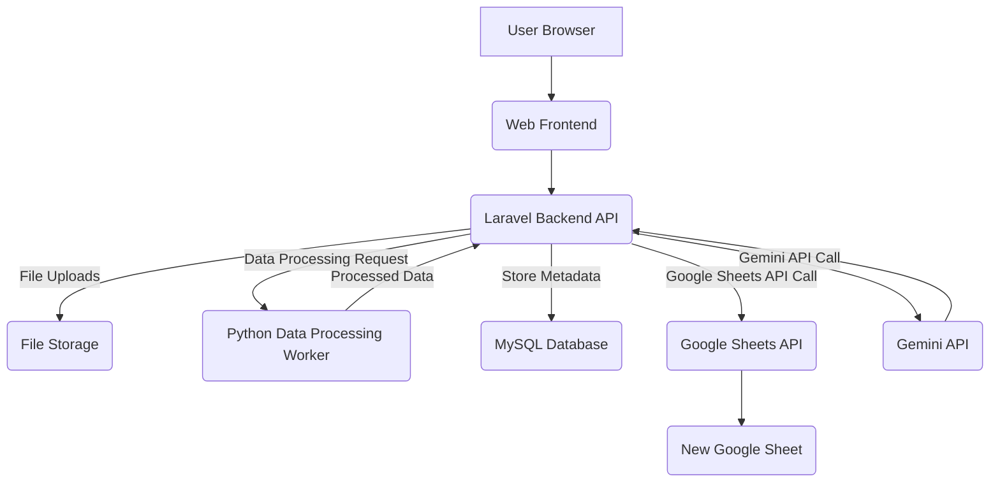

# Project: ITOC Auto Report Generator

## 1. Project Overview

The ITOC Auto Report Generator is a web-based system designed to automate the creation of daily reports for the IT Operation Center. This system will replace a manual, error-prone process involving VLOOKUPs and Pivot Tables in Excel with a streamlined, one-click solution. It leverages a robust backend for data processing, integrates with Google Sheets API for report generation and formatting, and utilizes Gemini API for intelligent schema matching and executive summary generation.

## 2. Goals & Non-Goals

### 2.1. Goals

*   **Automate Daily Reporting:** Eliminate manual data manipulation in Excel for ITOC daily reports.
*   **One-Click Report Generation:** Enable users to generate a complete daily report with minimal interaction after uploading raw data.
*   **Google Sheets Integration:** Output formatted reports directly to a new Google Sheet, ready for team communication platforms.
*   **Intelligent Assistance:** Provide smart schema matching and AI-generated executive summaries via Gemini API.
*   **User-Friendly Interface:** Offer a clean, responsive, and intuitive web interface for file uploads and agent input.
*   **Scalability:** Design the data processing engine to efficiently handle large Excel/CSV files.
*   **History & Master Data:** Store a history of generated reports and maintain master data for ITOC agents.

### 2.2. Non-Goals

*   **Real-time Data Sync:** The system is designed for batch processing of uploaded files, not real-time integration with ITSM systems.
*   **Advanced Analytics Dashboard:** While it generates reports, it will not include an interactive analytics dashboard for historical data.
*   **User Management beyond Authentication:** Basic user authentication (login/logout) will be implemented, but complex user roles, permissions, or multi-tenancy are out of scope.
*   **Direct Communication Platform Integration:** The system will provide a Google Sheets link and a text summary; direct posting to platforms like WhatsApp or Slack is not included.

## 3. Architecture

### 3.1. High-Level Architecture

The system follows a client-server architecture with a clear separation between frontend, backend API, data processing engine, and external API integrations.

### 3.2. Detailed Tech Stack

*   **Frontend:**
    *   **HTML5, CSS3, JavaScript (Vanilla JS, jQuery):** Core web technologies for structure, styling, and interactivity.
    *   **Bootstrap 5.x:** Responsive UI framework for layout, components (forms, buttons, modals, navigation), and overall aesthetic.
    *   **CDN:** For Bootstrap and jQuery assets to ensure fast loading.
*   **Backend (Main Controller):**
    *   **Laravel 10.x (PHP 8.2+):** Robust MVC framework for routing, request handling, file uploads, authentication, database interaction, and orchestrating calls to the Python worker and external APIs.
    *   **Composer:** PHP dependency management.
*   **Data Processing Engine:**
    *   **Python 3.9+:** Dedicated for data manipulation.
    *   **pandas:** For efficient data cleaning, transformation, merging (VLOOKUP equivalent), and aggregation (Pivot Table equivalent).
    *   **openpyxl:** For reading/writing Excel files in Python.
    *   **gspread & google-auth-oauthlib:** For direct interaction with Google Sheets API from Python (if Python worker handles direct sheet writing, otherwise Laravel handles it). *Assumption: Laravel will orchestrate the Google Sheets API calls directly.*
*   **Database:**
    *   **MySQL 8.0+:** Relational database for storing system data:
        *   `users`: User authentication (Laravel default).
        *   `reports`: History of generated reports (file paths, links, metadata).
        *   `agents`: Master list of ITOC agents (NIK, Name, Domain ID) for dynamic input.
        *   `activity_logs`: System activity and errors.
*   **Integrations:**
    *   **Google Sheets API:** Used by Laravel to create new spreadsheets, write data arrays, and apply formatting (borders, colors, auto-fit columns). Requires Google Cloud Project setup with Sheets API enabled and service account credentials.
    *   **Gemini API:** Used by Laravel to:
        *   Assist in schema matching: Analyze uploaded file headers against expected schema.
        *   Generate executive summaries: Produce narrative text based on aggregated report data. Requires Google Cloud Project setup with Gemini API enabled and API key.
*   **File Storage:**
    *   Local disk storage (e.g., `storage/app/public/uploads`) for raw uploaded SLA and Report files. Files will be temporarily stored during processing and may be retained for historical purposes.

## 4. Phased Delivery Plan

The project will be delivered in four distinct phases, each with specific deliverables and acceptance criteria.

### 4.1. Phase 1: Core System Setup & UI

**Objective:** Establish the foundational Laravel application, configure the database, and build the core user interface for file uploads and agent input.

**Deliverables:**
*   **Laravel Project Initialization:** A fully functional Laravel 10.x application.
*   **Database Setup:** MySQL database configured with `users`, `reports`, and `agents` tables.
    *   `users`: `id`, `name`, `email`, `password`, `created_at`, `updated_at`.
    *   `reports`: `id`, `user_id`, `report_date` (DATE), `sla_file_path` (VARCHAR), `report_file_path` (VARCHAR), `agent_nicks` (JSON), `google_sheet_link` (VARCHAR, nullable), `summary_text` (TEXT, nullable), `status` (ENUM: 'pending', 'processing', 'completed', 'failed'), `created_at`, `updated_at`.
    *   `agents`: `id`, `nik` (VARCHAR, unique), `name` (VARCHAR), `domain_id` (VARCHAR, nullable), `created_at`, `updated_at`.
*   **Authentication System:** Basic user registration and login functionality using Laravel Breeze or Jetstream (minimal scaffold).
*   **Main Report Generation UI:**
    *   A single web page accessible after login.
    *   File input for "SLA mentah" (`.xlsx`, `.csv`).
    *   File input for "Report mentah" (`.xlsx`, `.csv`).
    *   Dynamic tag input field for "Agent Duty" (NIK/Domain). This input should leverage the `agents` master data for auto-suggestion/autocomplete.
    *   "Generate Report" button.
    *   Basic styling using Bootstrap 5.x.

**Acceptance Criteria (Phase 1):**
*   User can register and log in successfully.
*   The application displays the main report generation form after login.
*   Users can select and upload `.xlsx` and `.csv` files for both SLA and Report inputs.
*   The "Agent Duty" input field allows typing and adding multiple NIKs/Domains as tags. It should suggest agents from the `agents` table as the user types.
*   Uploaded files are stored securely on the server (e.g., `storage/app/public/uploads`).
*   Database migrations are complete and tables exist with correct schemas.
*   The UI is responsive and visually consistent with Bootstrap 5.x design principles.

### 4.2. Phase 2: Data Processing Engine

**Objective:** Develop the core data cleaning, merging, and aggregation logic using Python pandas, orchestrated by Laravel.

**Deliverables:**
*   **Python Data Processing Script:** A Python script (`process_report.py`) that accepts file paths and agent NIKs as arguments.
*   **Data Cleaning (SLA):**
    1.  Load raw SLA file into a pandas DataFrame.
    2.  Drop columns B through R (e.g., `df.drop(df.columns[1:18], axis=1)`).
    3.  Filter rows where `SVTTitle` column value is exactly `"SC3 - IT OLA Response - 0010"`.
    4.  Sort data by `OverallElapsedTime` in ascending order.
    5.  Store this cleaned DataFrame (`df_sla`).
*   **Data Merging (VLOOKUP Equivalent):**
    1.  Load raw Report file into a pandas DataFrame.
    2.  Perform a `Left Join` (`pd.merge`) of the Report DataFrame with `df_sla`.
    3.  **Assumption:** The join key is `IncidentID`. Both `SLA` and `Report` files are assumed to contain an `IncidentID` column.
    4.  Handle potential missing `IncidentID` values gracefully (e.g., fillna or warn).
*   **Data Aggregation (Pivot Table Equivalents):**
    1.  **Pivot Table 1: Incidents by Category & Status:**
        *   Group by `Category` and `Status`.
        *   Count `IncidentID` for each group.
        *   Output as a DataFrame.
    2.  **Pivot Table 2: SLA Breaches by Agent:**
        *   Filter merged data for incidents where `OverallElapsedTime` > 14400 (4 hours in seconds, common SLA breach threshold). *Assumption: A specific SLA threshold for "breach" is 4 hours.*
        *   Group by `Assignee` (agent NIK/Domain).
        *   Count `IncidentID` for each agent.
        *   Output as a DataFrame.
    3.  **Pivot Table 3: Top 5 Incident Categories:**
        *   Group merged data by `Category`.
        *   Count `IncidentID` for each category.
        *   Sort in descending order and select the top 5 categories.
        *   Output as a DataFrame.
*   **Laravel Integration with Python:**
    *   Laravel controller method to:
        *   Save uploaded files to a temporary location.
        *   Dispatch a background job (e.g., Laravel Queue) that executes the Python script, passing file paths and agent NIKs.
        *   Receive the processed data (e.g., JSON output from Python script containing aggregated data for each pivot table).
        *   Update the `reports` table with `status = 'processing'` and then `status = 'completed'` or `status = 'failed'`.

**Acceptance Criteria (Phase 2):**
*   User uploads files and clicks "Generate Report".
*   Laravel successfully stores the files and triggers the Python processing.
*   The Python script correctly performs:
    *   Column dropping (B-R from SLA).
    *   Row filtering (`SVTTitle` == `"SC3 - IT OLA Response - 0010"`).
    *   Sorting by `OverallElapsedTime`.
    *   Left Join using `IncidentID` as the key.
    *   Generation of three distinct aggregated data sets (DataFrames) for:
        1.  Incidents by Category & Status.
        2.  SLA Breaches by Agent.
        3.  Top 5 Incident Categories.
*   The Python script returns these aggregated data sets as JSON to Laravel.
*   Laravel updates the `reports` table status appropriately based on processing success or failure.
*   Error handling is implemented for cases like malformed files, missing columns, or Python script failures.

### 4.3. Phase 3: Google Sheets Reporting

**Objective:** Integrate with Google Sheets API to create, populate, and format the final daily report.

**Deliverables:**
*   **Google Cloud Project Setup:** Instructions for enabling Google Sheets API and generating a service account key (JSON).
*   **Laravel Google Sheets Service:** A Laravel service class (e.g., `GoogleSheetsService`) to encapsulate Google Sheets API interactions using `google/apiclient`.
*   **Sheet Creation & Data Writing:**
    *   Create a new Google Sheet with a dynamic name (e.g., "ITOC Daily Report YYYY-MM-DD").
    *   Create multiple tabs/sheets within the new Google Sheet: "Summary", "SLA Breaches", "Top Categories".
    *   Write the aggregated data (from Phase 2) into the respective sheets.
*   **Sheet Formatting:** Apply programmatic formatting to the generated Google Sheet:
    *   **Header Styling:** Bold font, light gray background (`#E0E0E0`) for the first row of each sheet.
    *   **Borders:** Apply borders to all cells containing data.
    *   **Auto-fit Columns:** Adjust column widths to fit content.
    *   **Freeze Panes:** Freeze the first row of each sheet.
*   **Report Link Storage:** Store the public link to the newly created Google Sheet in the `reports` table.
*   **UI Update:** Display the Google Sheet link on the report generation page once processing is complete.

**Acceptance Criteria (Phase 3):**
*   User initiates report generation.
*   Upon successful data processing (Phase 2), a new Google Sheet is created in the configured Google Drive.
*   The Google Sheet has three tabs: "Summary", "SLA Breaches", "Top Categories".
*   Each tab is populated with the correct aggregated data from Phase 2.
*   All sheets have their first row formatted as bold with a light gray background.
*   All data cells have borders.
*   All columns are auto-fitted to content.
*   The first row of each sheet is frozen.
*   The public URL of the generated Google Sheet is saved in the `reports` table.
*   The UI displays the clickable Google Sheet link to the user.

### 4.4. Phase 4: AI Integration (Gemini API)

**Objective:** Integrate Gemini API for intelligent schema matching assistance and automated executive summary generation.

**Deliverables:**
*   **Google Cloud Project Setup:** Instructions for enabling Gemini API and generating an API key.
*   **Laravel Gemini Service:** A Laravel service class (e.g., `GeminiService`) to interact with the Gemini API.
*   **Schema Matching Assistant:**
    *   When a user uploads a file, allow an optional "Analyze Schema" button.
    *   Send the first few rows (as JSON or CSV string) of the uploaded file to Gemini API with a prompt to identify column headers and suggest if they match a predefined expected schema (e.g., `IncidentID`, `SVTTitle`, `Category`, `Status`, `Assignee`, `OverallElapsedTime`).
    *   Display Gemini's suggestions or warnings in the UI if discrepancies are found.
*   **Executive Summary Generation:**
    *   After all pivot tables are generated (Phase 2), send the key aggregated data points (e.g., total incidents, total SLA breaches, top 5 categories and their counts) to Gemini API.
    *   Prompt Gemini to generate a concise, narrative executive summary suitable for a daily report (e.g., "Today's report shows X total incidents, Y of which were SLA breaches. Top categories include A (Z incidents), B (W incidents), etc.").
    *   Store the generated summary text in the `reports` table (`summary_text` column).
*   **UI Update:**
    *   Display the generated executive summary text on the report generation page alongside the Google Sheet link.
    *   Provide a "Copy to Clipboard" button for the summary text.

**Acceptance Criteria (Phase 4):**
*   User can upload a file and use the "Analyze Schema" feature.
*   Gemini API successfully analyzes the file headers and provides relevant feedback/suggestions in the UI regarding schema matching.
*   Upon successful report generation, an executive summary is generated by Gemini API.
*   The summary text is stored in the `reports` table.
*   The UI displays the executive summary text.
*   The "Copy to Clipboard" button for the summary text functions correctly.
*   Gemini API calls are handled asynchronously to avoid blocking the main thread.

## 5. Critical Rules

1.  **Security First:** All file uploads must be validated for type and size. API keys and service account credentials must be stored securely (e.g., environment variables) and never hardcoded. User authentication is mandatory.
2.  **Data Integrity:** The Python data processing script must handle edge cases like empty files, malformed rows, or missing expected columns gracefully, logging errors where appropriate.
3.  **Performance:** File processing, especially for large files, should be handled asynchronously (e.g., Laravel Queues) to prevent UI blocking and timeouts.
4.  **Error Handling & Logging:** Comprehensive error logging (Laravel logs, Python logs) must be implemented for all phases, especially during file processing and API interactions.
5.  **Configuration:** All API keys, Google Cloud project IDs, and other sensitive configurations must be externalized in `.env` files.
6.  **Code Quality:** Adherence to PSR standards for PHP, PEP 8 for Python, and clean, well-documented code is required.

## 6. Testing Strategy

*   **Unit Tests:**
    *   **Laravel (PHPUnit):** Test individual controllers, services, models, and helper functions (e.g., file upload validation, database interactions).
    *   **Python (Pytest):** Test individual data processing functions (cleaning, merging, aggregation logic) with mock data.
*   **Integration Tests:**
    *   **Laravel ↔ Database:** Verify correct data storage and retrieval.
    *   **Laravel ↔ Python Worker:** Test the command execution and data exchange between Laravel and the Python script.
    *   **Laravel ↔ Google Sheets API:** Test sheet creation, data writing, and formatting with a dedicated test Google Account/Sheet.
    *   **Laravel ↔ Gemini API:** Test prompt sending and response parsing for schema analysis and summary generation.
*   **End-to-End (E2E) Tests:**
    *   **Browser-based (e.g., Cypress or Laravel Dusk):** Simulate full user flow from login, file upload, agent input, "Generate Report" click, to verifying the Google Sheet link and summary text in the UI.
*   **Performance Testing:**
    *   Test the system's ability to handle large input files (e.g., 100MB Excel files) and multiple concurrent report generation requests, focusing on queue processing times.
*   **Security Testing:**
    *   Test for common web vulnerabilities (XSS, CSRF, SQL Injection, insecure file uploads).

## 7. Deployment Strategy

1.  **Containerization (Docker):**
    *   Create `Dockerfile`s for the Laravel application (PHP-FPM + Nginx), MySQL database, and Python data processing environment.
    *   Use `docker-compose.yml` for local development and to define multi-service application.
2.  **Version Control (Git):**
    *   All code will be managed in a Git repository (e.g., GitHub, GitLab).
    *   Follow a branching strategy (e.g., Git Flow or GitHub Flow).
3.  **Continuous Integration/Continuous Deployment (CI/CD):**
    *   Utilize a CI/CD pipeline (e.g., GitHub Actions, GitLab CI, Jenkins) to:
        *   Automatically run tests (unit, integration, linting) on every push to `develop`/`main`.
        *   Build Docker images.
        *   Deploy to staging/production environments upon successful builds and tests.
4.  **Production Environment:**
    *   **Cloud Provider:** Deploy to a cloud platform (e.g., AWS EC2, DigitalOcean Droplets, Google Cloud Run/Compute Engine).
    *   **Orchestration:** Use Docker Swarm or Kubernetes for container orchestration in production if scalability beyond a single instance is required. For initial deployment, `docker-compose` on a single VM might suffice.
    *   **Web Server:** Nginx to serve the Laravel application.
    *   **Database:** Managed MySQL service (e.g., AWS RDS, Google Cloud SQL) for high availability and backups.
    *   **Queue Worker:** Dedicated process or container for Laravel Queue workers to handle background tasks.
    *   **Environment Variables:** All sensitive configurations injected as environment variables.
    *   **Monitoring & Logging:** Integrate with cloud-native monitoring and logging solutions (e.g., AWS CloudWatch, Stackdriver).
    *   **HTTPS:** Secure all traffic with SSL/TLS certificates (e.g., Let's Encrypt).
5.  **Backup & Recovery:**
    *   Implement regular database backups.
    *   Consider backup strategies for uploaded files if long-term retention is required beyond the `reports` table metadata.